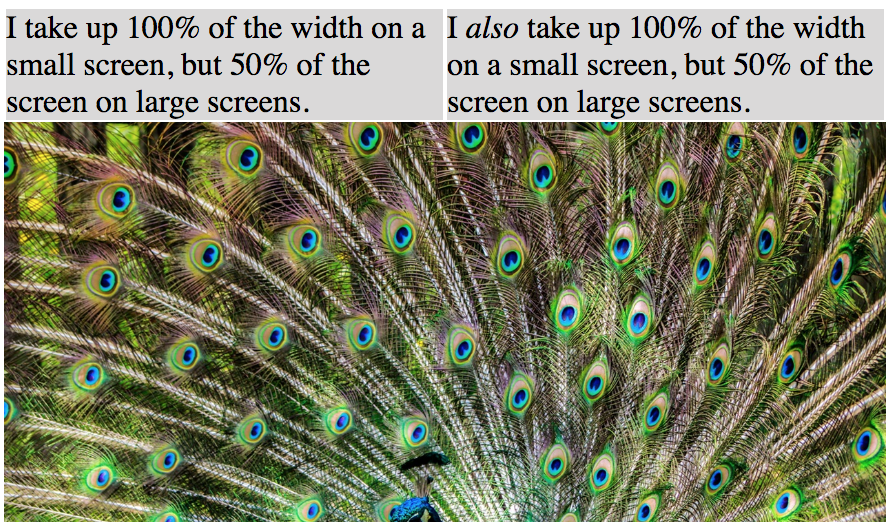
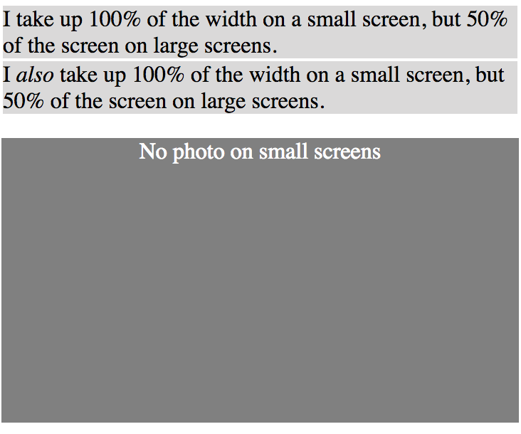

# Exercise-1
In this short exercise, you'll practice writing media queries to conditionally apply styles at different screen sizes. Remember, in a mobile-first approach, the default styles are built for _small screens_, and media rules are written to enhance the layout on larger screens.

This is the desired layout for large screens (>768px):

And this is the layout for small screens:

As described in [module-4](https://github.com/info343c-a16/m4-git-intro), start by forking and cloning this repository. Then, in your `css/main.css` file, apply the following styles:

1. Elements with class `wrapper` should display `inline-block`, have a font-size of `2rem`, be wrapped in a `2px solid white` border, and have a background of `#dad9d9`.
2. The `
` with id `photo` should have a height of 400px and a gray background.
3. The paragraph _inside_ the div with id `photo` should have a font-size of `2rem`, should render text in the color `white`, and should align it's text in the center.

Apply the following styles when the screen is _larger_ than 768px:

1. Elements with class `wrapper` should have a width of 50%.
2. The paraphgrah _inside_ the div with id `photo` should be _hidden_.
3. The element with id `photo` should have a background image that renders the photo in the `imgs/` folder. The background size should `cover` the div, and it _should not_ repeat.

See `complete` branch for answers.
